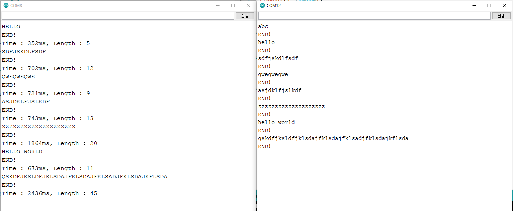

# arduino_light_communication
 LED와 빛감지센서를 이용한 무선 통신 - 시스템프로그래밍 수업 프로젝트

### 요구 사항

알파벳(대소문자 구분 X)과 띄어쓰기까지 전송할 수 있어야 함. 한 쪽에서는 LED 하나로 신호를 보내고, 다른 한 쪽에서는 빛 감지 센서로 신호를 감지한다. 두 아두이노 보드는 서로 연결되어 있으면 안 된다.

### 전송 프로토콜 

처음에는 모스부호로 간단하게 했다가 더 빠른 방법이 있을 것 같아서 새로 만들어보았다.

알파벳 26자와 띄어쓰기, 총 27개의 문자를 보낼 수 있으면 되므로, 3진수로 3개의 신호를 한 문자로 인식하게 하면 가장 효율적일 것 같았다.

예를들면 띄어쓰기는 000, a는 001, b는 002, c는 010, z는 222로 치환되는 형식이다.

신호가 0일 때는 10ms를, 1일때는 20ms를, 3일때는 30ms 동안 신호를 주게 하였는데, 해당 시간 동안 켜졌다가 꺼지는게 아니라, 켜졌다 굳이 꺼지는 시간도 아깝기 때문에 그 전 상태에 꺼져있으면 해당 시간 동안 켜지고, 그 전 상태에 켜져있으면 해당 시간 동안 꺼지도록 하였다.

다만, 보내는 문자의 개수가 짝수개일 경우 마지막 문자의 마지막 신호를 보내고 나서 얼마동안 꺼져있는지 모르게 되는데, 이를 해결하기 위해 이때는 마지막에 60ms동안 한 번 켰다가 끄는 finish 신호를 주었다.

### 결과

본래 평가 만점 기준은 10초 안에 20개의 문자를 보내는 거였지만, 20개의 문자는 가장 신호 길이가 긴 경우(Z만 20개)에도 1.8초만에 보낼 수 있었다.